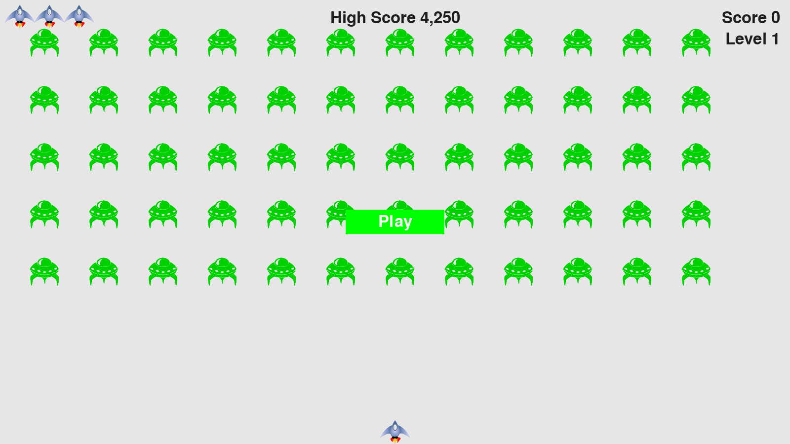
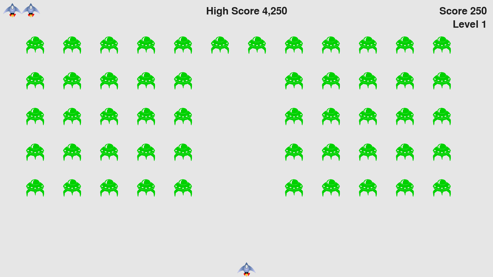

# Alien-Invasion
Simple pixel game built in python with the use of pygame!

## Installing

To get started, follow these steps:

1. Clone the repository:

    ```bash
    git clone https://github.com/arcademiss/Alien-Invasion.git
    ```

2. Navigate to the project directory:

    ```bash
    cd Alinen-Invasion
    ```

3. Create and activate a virtual environment (optional but recommended):

    ```bash
    python -m venv venv
    source venv/bin/activate  # On Unix or MacOS
    venv\Scripts\activate     # On Windows
    ```

4. Install project dependencies:

    ```bash
    pip install -r requirements.txt
    ```

## Play

Starting the game is simple. Follow these steps:

1. Run the application:

    ```bash
    python alien_invasion.py
    ```

    This will launch the start screen.

2. Press 'P' and play or 'q' and quit!

3. Use left and right arrows to move around and 'space' to shoot the invading aliens!

## Screenshot




### Note

This is a for fun project, treat it as it is.